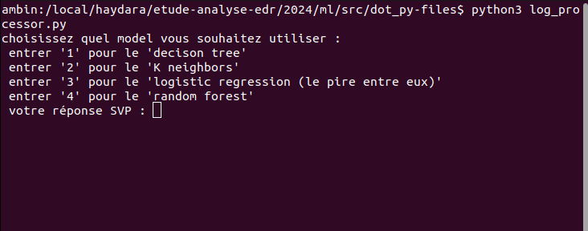
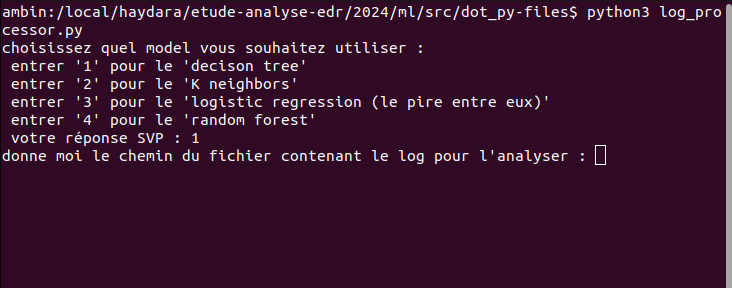
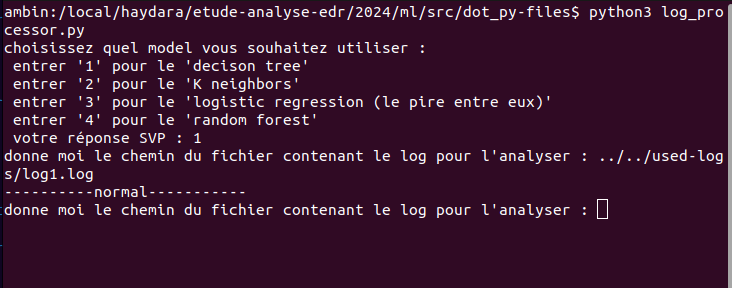

# Using "INTRUSION DETECTOR"

## Project Organization

This document describes the folder arrangement in the project to facilitate understanding and code management.

### Folder Structure

Here's the folder structure of my project:
```
ml/
├── columns/
│   └── columns.csv
├── data/
│   ├── interim/
│   │   └── conn_log_labeled-cleaned.csv
│   ├── processed/
│   │   └── conn_log_labeled-processed.csv
│   └── raw/
│       └── conn.log.labeled
├── encoder/
│   └── onehot_encoder.pkl
├── models/
│   ├── decision_tree.pkl
│   ├── k_nearest_neighbors.pkl
│   ├── logistic_regression.pkl
│   └── random_forest.pkl
├── src/
│   ├── dot_ipynb-files/
│   │   ├── data_cleaning.ipynb
│   │   ├── data-processing.ipynb
│   │   └── model-training.ipynb
│   └── dot_py-files/
│       ├── intrusion-detector.py
│       ├── log_processor.py
│       └── __pycache__
└── used-logs/
    ├── conn.log
    ├── log1.log
    ├── log2.log
    └── logs-processed.csv
```
- **src**: 
    - **dot_ipynb-files**: Here you'll find the Python notebook codes: for model training, execute these files in the following order.
        1.  data_cleaning.ipynb: to clean the dataset we have.
        2.  data-processing.ipynb: to prepare the dataset for use in model training.
        3.  model-training.ipynb: here we train the models.
    - **dot_py-files**: To see the results of one of the models on all logs in the file generated by Zeek, execute: **intrusion-detector.py**. If you want to process logs one at a time with the model, execute: **log_processor.py**.
- **data**: 
    - raw: Here you'll find the original dataset
    - interim: Here you'll find the cleaned dataset.
    - processed: Here you'll find the processed dataset.
- **models**: This is where we put our trained models. Simply import them to use them.
- **encoder**: Where we put an encoder for later reuse.
- **columns**: Where we put columns for data processing.
- **used-logs**: Here we put the logs to be processed by our model.
    - For logs one by one, we use log1.log and log2.log, and for intrusion-detector.py we use conn.log.
## How it works: 
### For training:
See the explanation of the src/dot_ipynb-files folder.
### To Use the model: 
- You can run intrusion-detector.py to understand how it works, but the most interesting program is **log_processor.py**, as it can be used with Wazuh since it can analyze logs one by one.



2. Now you need to choose an algorithm to use.



3. Now you need to give it a path to a .log file where the log to be analyzed is located.


Here the model indicates that this log is not malicious.
4. Now give it a new path or give it the same path after replacing the old log with a new log.
## Configure Zeek
Official page explaining the logs generated by Zeek: https://docs.zeek.org/en/master/logs/conn.html 
### Download and install Zeek: 
```
cd /usr/local/src
wget https://download.zeek.org/zeek-4.2.0.tar.gz
tar -xvzf zeek-4.2.0.tar.gz
cd zeek-4.2.0
./configure
make
sudo make install
```
### Add Zeek to the Path: 
```
echo "export PATH=/usr/local/zeek/bin:$PATH" | sudo tee -a /etc/profile
source /etc/profile
```
### Verify Zeek installation
```
zeek --version
```
### Install and configure the Wazuh agent:
```
sudo yum install -y https://packages.wazuh.com/4.x/yum/wazuh-agent-4.x.rpm
```
### Modify the Wazuh agent configuration file to point to your Wazuh manager: 
```
sudo vi /var/ossec/etc/ossec.conf
```
### In the `<auth> </auth>` tag, add: 
```
  <manager >
    <address>MANAGER_IP</address>
    <port>1514</port>
  </manager>
```
### Enable and start the Wazuh agent: 
```
sudo systemctl enable wazuh-agent
sudo systemctl start wazuh-agent
```
## Every time we start Wazuh, we must start Zeek with: 
```
sudo /usr/local/zeek/bin/zeekctl deploy
sudo /usr/local/zeek/bin/zeekctl start
```
You can check its status with: `sudo /usr/local/zeek/bin/zeekctl status`
:::success
You can find the Logs generated by Zeek in `/usr/local/zeek/logs/current/conn.log`
:::